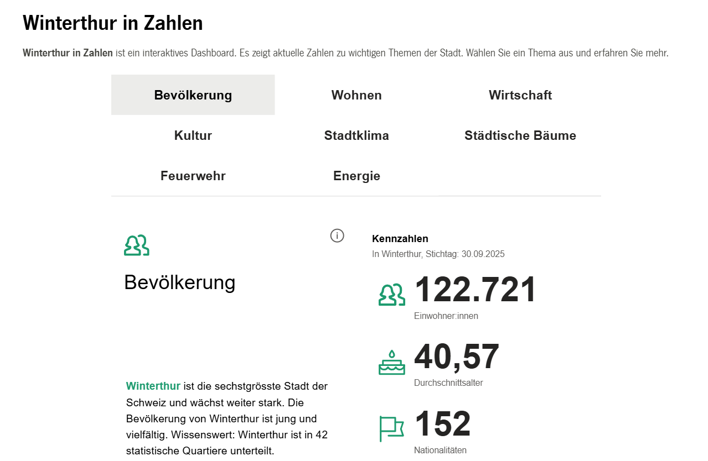

Diese Fragen habe ich bei der Weiterbildung zu Open Government Data & Data Management am Institut Public Sector Transformation (IPST) der Berner Fachhochschule BFH diskutiert - mit Beispielen aus der Stadt Winterthur.

<!-- truncate -->

Mit dem Dashboard [«Winterthur in Zahlen»](https://stadt.winterthur.ch/themen/die-stadt/winterthur-in-zahlen) macht die Stadt Winterthur offene Daten zugänglich. Statt trockener Tabellen zeigen dort Grafiken und Karten, wie viel Strom verbraucht wird, wie viele Menschen die Bibliotheken besuchen, oder wann die Feuerwehr ausrückt.

Damit Winterthur in Zukunft noch mehr aus seinen Daten macht, erarbeiten wir nun eine Datenstrategie. Unser Ziel: eine effizientere Verwaltung, bessere digitale Services, mehr Transparenz und fundierte Entscheidungen – zum Wohl der Stadt.
