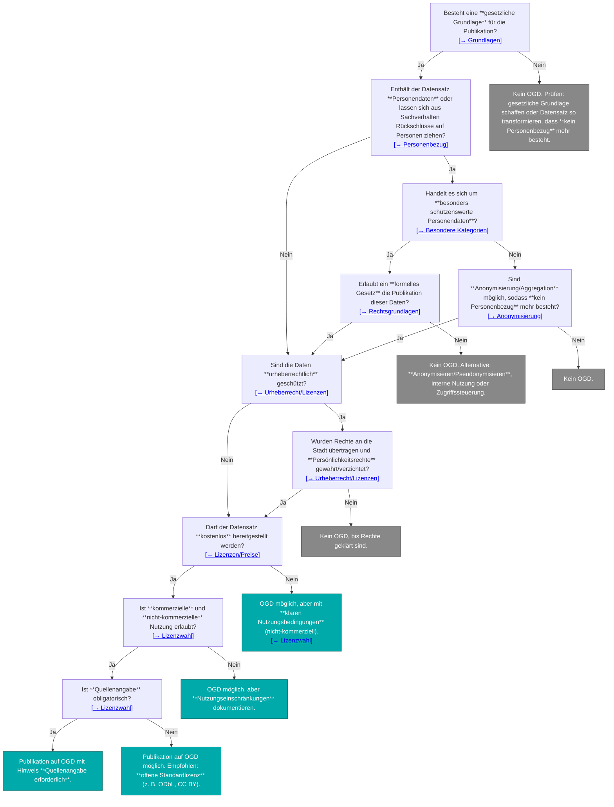

# Datenschutz-Hilfsmittel
:::info

Dieses Hilfsmittel zeigt, wie mit schützenswerten Daten umgegangen wird und welche technischen Massnahmen vor einer Publikation als Open Government Data nötig sind. 

:::

Hier soll die Datensouveränität, Löschfristen und Datensicherheit, wie auch der Schutz angesprochen und State- of the Art Ansätze geliefert werden - dies wird in Anlehnung an den [OGD-Masterplan] der Schweiz.

[OGD-Masterplan]: https://data.europa.eu/sites/default/files/2025-06/2024_odm_factsheet_switzerland.pdf

import Tabs from '@theme/Tabs';
import TabItem from '@theme/TabItem';

<Tabs queryString="metadata">
  <TabItem value="ansaetze" label="Ansätze">
    Dies sind Ansätze.
  </TabItem>
  <TabItem value="bestpractices" label="Best- practices">
    Dies sind best- practices.
  </TabItem>
</Tabs>

TODOs:

- [ ] Grundlagen erarbeiten
- [ ] Beispiel für Re-Identifikation zeigen (siehe z.B. https://spatialists.ch/posts/2025/07/01-differential-privacy-being-wrong-on-purpose/index.html, https://programming-dp.com/)
- [ ] Beispiel für Aggregation und andere Anonymisierungsmethoden zeigen
- [ ] Beispiel für Pseudonymisierung (z.B. Hunderegister Stadt Zürich, https://data.stadt-zuerich.ch/dataset/sid_stapo_aktueller_hundebestand_monat_od1003)
- [ ] Flowchart à la https://handbook.opendata.swiss/de/content/glossar/bibliothek/ogd-richtlinien.html, evtl. mit Absprungpunkten zu verschiedenen Unterkapiteln, Mermaid siehe https://mermaid.js.org/syntax/flowchart.html, oder https://github.com/ebp-group/225348-Winterthur-OGD-Docs/edit/main/docs/ogd-handbuch/prozesse/index.md

