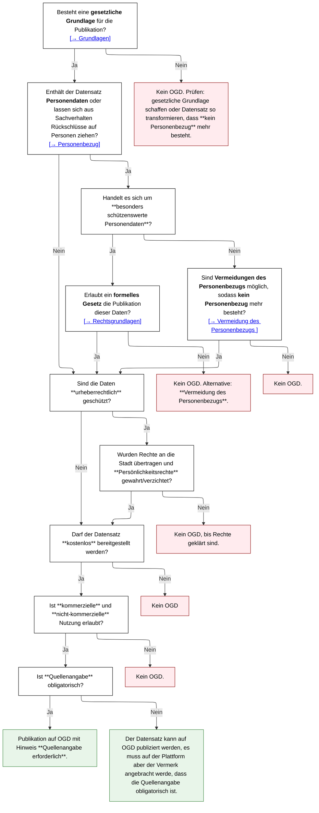

# Datenschutz-Hilfsmittel

Im Rahmen der Open Government Data (OGD) Strategie der Stadt Winterthur ist die Einhaltung des Datenschutzes von zentraler Bedeutung. Die Veröffentlichung von Verwaltungsdaten soll die Transparenz, Partizipation und Innovation fördern, darf jedoch die Rechte und Freiheiten betroffener Personen nicht verletzen.

Dieses Hilfsmittel zeigt, wie mit schützenswerten Daten umgegangen wird und welche rechtlichen Prüfschritte sowie technischen Massnahmen vor einer Publikation als Open Government Data nötig sind. Es soll als Leitfaden dienen, wenn Datenschutzbedenken im Raum stehen und wie diese gelöst werden können. Dazu stehen Best-Practices zur Verfügung, wie der Datenschutz gewährt werden kann, ohne die Datenqualität unnötig zu tangieren.

Der nachfolgende Entscheidungsbaum dient den Mitarbeitenden der Stadtverwaltung als praktisches Instrument zur schnellen Beurteilung eines Datensatzes. Er führt systematisch durch die relevanten Fragen – von der gesetzlichen Grundlage über den Umgang mit Personendaten bis hin zur Klärung von Urheber- und Nutzungsrechten – und zeigt klar auf, wann eine OGD-Publikation möglich ist und welche Schritte dafür erforderlich sind.

:::info
Kann eine Frage nicht klar beantwortet werden, steht die [Arbeitshilfe für Behörden zur Publikation von Daten als OGD] zur weiteren Erläuterung zur Verfügung.
:::
[Arbeitshilfe für Behörden zur Publikation von Daten als OGD]: https://www.bfs.admin.ch/bfs/de/home/dienstleistungen/ogd/dokumentation.assetdetail.11147071.html