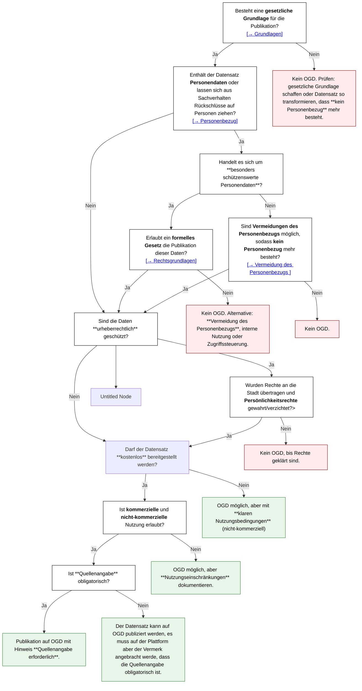

# Datenschutz-Hilfsmittel

Dieses Hilfsmittel zeigt, wie mit schützenswerten Daten umgegangen wird und welche technischen Massnahmen vor einer Publikation als Open Government Data nötig sind. Es soll als Leitfaden dienen, wenn datenschutzbedenken im Raum stehen und wie diese gelöst werden können. Dazu stehen best- practices zur Verfügung, wie der Datenschutz gewährt werden kann, ohne die Datenqualität zu tangieren. 

:::info
Kann eine Frage nicht klar beantwortet werden, steht die [Arbeitshilfe für Behörden zur Publikation von Daten als OGD] zur weiteren Erläuterung zur Verfügung.
:::
[Arbeitshilfe für Behörden zur Publikation von Daten als OGD]: https://www.bfs.admin.ch/bfs/de/home/dienstleistungen/ogd/dokumentation.assetdetail.11147071.html

## TODOs:

- [ ] Grundlagen erarbeiten
- [ ] Beispiel für Re-Identifikation zeigen (siehe z.B. https://spatialists.ch/posts/2025/07/01-differential-privacy-being-wrong-on-purpose/index.html, https://programming-dp.com/)
- [ ] Beispiel für Aggregation und andere Anonymisierungsmethoden zeigen
- [ ] Beispiel für Pseudonymisierung (z.B. Hunderegister Stadt Zürich, https://data.stadt-zuerich.ch/dataset/sid_stapo_aktueller_hundebestand_monat_od1003)
- [ ] Flowchart à la https://handbook.opendata.swiss/de/content/glossar/bibliothek/ogd-richtlinien.html, evtl. mit Absprungpunkten zu verschiedenen Unterkapiteln, Mermaid siehe https://mermaid.js.org/syntax/flowchart.html, oder https://github.com/ebp-group/225348-Winterthur-OGD-Docs/edit/main/docs/ogd-handbuch/prozesse/index.md

