# Übersicht der OGD-Prozesse

```mermaid
flowchart TD
    do@{ label: "🗝️ Data Owner", shape: text}
    ogd@{ label: "🎯 Fachstelle OGD", shape: text}
    user@{ label: "🔧 Nutzende", shape: text}

    production["Produktion"]
    provide["Bereitstellung"]
    pub["Publikation"]
    portal@{ shape: paper-tape, label: "OGD-Portal"}
    usage["Datennutzung"]
    requests["Anfragen"]

    subgraph Erstellung
    production --> provide
    provide --> pub
    end

    subgraph "Zugang"
    pub --> portal
    end

    subgraph Nutzung
    portal --> usage
    end

    user -.-> usage
    user --> requests --> do
    requests --> ogd

    do -.-> production
    do -.-> provide
    do -.-> pub

    ogd-. unterstützt .->provide
    ogd-. unterstützt .->pub
    ogd-. unterstützt .->portal
```

Bei der Veröffentlichung von Daten als offene Verwaltungsdaten können die in 
der Abbildung skizzierten drei Hauptakteure (Daten-Nutzende, Data Owner und das 
Fachstelle OGD) und die folgenden sechs Hauptprozesse unterschieden 
werden:

0. Produktion
0. Bereitstellung
0. Publikation
0. Anfragen
0. Support
0. Nutzung

Im Folgenden werden detaillierte Teilprozesse beschrieben, die zur Veröffentlichung offener Verwaltungsdaten nötig sind.

```mermaid
flowchart LR
  rN["👤 Endnutzer"]:::role
  rF["👤 FS Daten"]:::role
  rA["👤 OGD-Ansprechperson
  (Data Owner)"]:::role

  subgraph S["OGD-Angebot"]
    direction TB
    ucApp([Anwendungen])
    ucDP([Datenportal])
    ucMD([Metadata])
    ucD([Data])
    ucQA([Fragen, Anfragen zu Daten])
    ucFB([Fehlermeldungen, Feedback])
    ucDP -.-> ucMD
    ucMD -.-> ucD
  end
  
  rn ~~~ ucDP
  ucDP ~~~  rF
  ucDP ~~~ rF

  rN-- erstellt -->ucApp
  rN-- findet, sichtet -->ucMD
  rN-- sichtet, bezieht, nutzt -->ucD
  rN-- stellt -->ucQA
  rN-- gibt -->ucFB

  rF-- verantwortet, betreibt -->ucDP
  rA-- pflegt, stellt bereit -->ucMD
  rA-- bereitet auf, stellt bereit -->ucD

  rF-- berät, unterstützt ---rA

  
  classDef role stroke-width:0px;
```

