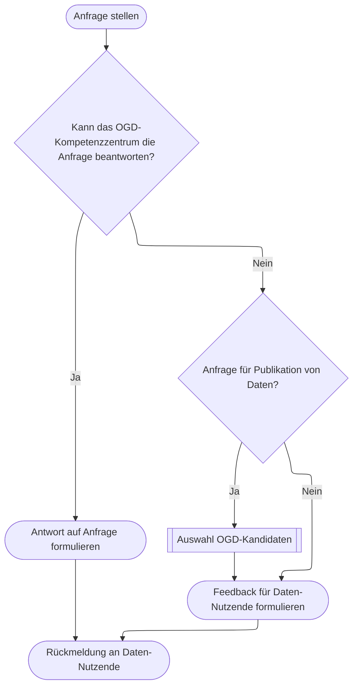
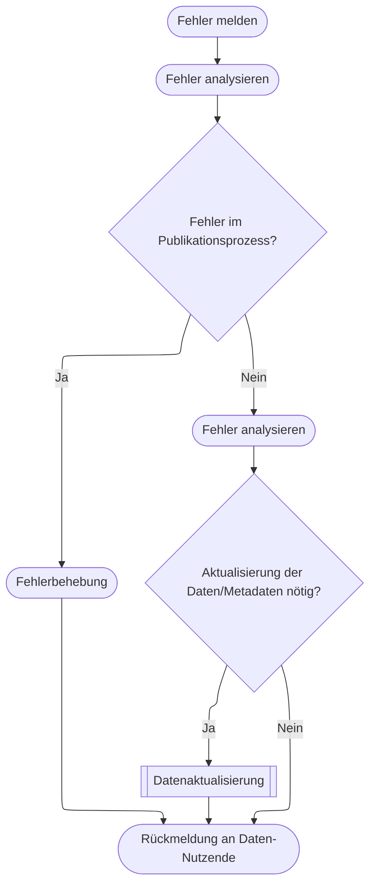

# Anfragen

## Anfragen zu Daten

Anfragen von Daten-Nutzenden lassen sich grob in zwei Kategorien einteilen:  
* Anfragen für die Publikation von neuen offenen Verwaltungsdaten 
* Verständnisfragen zu bereits veröffentlichten offenen Verwaltungsdaten 

 Das OGD-Kompetenzzentrum beantwortet Anfragen von Daten-Nutzenden möglichst selbst
 Falls dies nicht möglich ist, werden die Data Owner um ein Feedback gebeten und gegebenenfalls der Prozess zur Bereitstellung von neuen Daten angestossen. 

### Anfrage stellen 

### Antwort auf Anfrage formulieren 

### Feedback für Daten-Nutzende formulieren

### Rückmeldung an Daten-Nutzende 

## Fehler melden 

Ein Spezialfall einer Anfrage ist die Meldung eines Fehlers.
Dabei stellen Daten-Nutzende fest, dass Daten oder Metadaten fehlerhaft, unplausibel, unvollständig oder unverständlich sind.
Solche Rückmeldungen sind essenziell, um die Qualität von offenen Verwaltungsdaten laufend zu verbessern.
Sie sollten, wenn möglich und sinnvoll berücksichtigt werden.

Das OGD-Kompetenzzentrum prüft in einem ersten Schritt, ob gemeldete Sachverhalte während des Publikationsprozesses entstanden sind.
Solche werden vom OGD-Kompetenzzentrum selbst behoben.
Andernfalls erfolgt eine Rückmeldung an den Data Owner, so dass eine Aktualisierung der Daten oder der Metadaten vorgenommen werden kann. 

### Fehler melden 

### Fehler analysieren 

### Fehlerbehebung

### Rückmeldung an Daten-Nutzende 