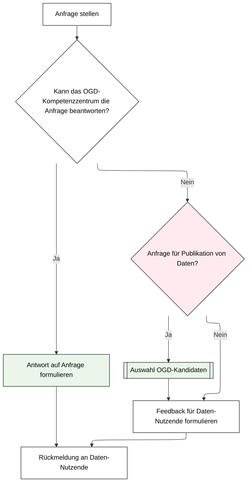
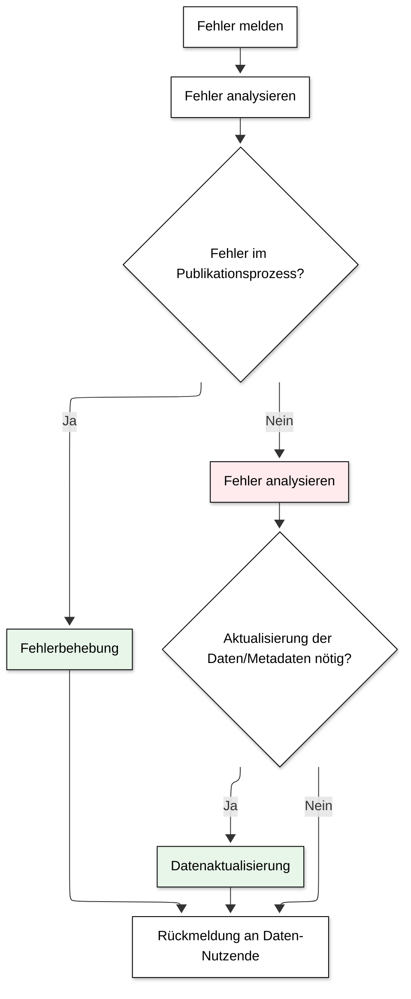

# Anfragen

## Anfragen zu Daten

Anfragen von Daten-Nutzenden lassen sich grob in zwei Kategorien einteilen:  
* Anfragen für die Publikation von neuen offenen Verwaltungsdaten 
* Verständnisfragen zu bereits veröffentlichten offenen Verwaltungsdaten 

 Das OGD-Kompetenzzentrum beantwortet Anfragen von Daten-Nutzenden möglichst selbst
 Falls dies nicht möglich ist, werden die Data Owner um ein Feedback gebeten und gegebenenfalls der Prozess zur Bereitstellung von neuen Daten angestossen. 

### Anfrage stellen

Anfragen können über sämtliche Kontaktmöglichkeiten zum OGD-Kompetenzzentrum gemeldet werden.
Gegenüber den Daten-Nutzenden tritt das OGD-Kompetenzzentrum als SPOC (_Single Point of Contact_) auf und triagiert die Anfragen nach Zuständigkeit und Dringlichkeit.

### Antwort auf Anfrage formulieren 

Wenn möglich wird die Anfrage direkt vom OGD-Kompetenzzentrum beantwortet.

### Feedback für Daten-Nutzende formulieren

In einigen Fällen muss auf das Fachwissen oder die Entscheidungskompetenz der Data Owner zurückgegriffen werden, um eine Anfrage zu beantworten.
In diesem Fall leitet das OGD-Kompetenzzentrum die Anfrage weiter mit der Bitte um entsprechende Abklärungen und Feedback. 

### Rückmeldung an Daten-Nutzende

Daten-Nutzende sollen in jedem Fall eine Antwort auf Anfragen erhalten.
In der Regel wird die Antwort auf eine Anfrage vom OGD-Kompetenzzentrum an Daten-Nutzende weitergegeben.
Data Ownern steht es selbstverständlich frei, sich selbst direkt mit den Daten-Nutzenden auszutauschen. 

## Fehler melden 

Ein Spezialfall einer Anfrage ist die Meldung eines Fehlers.
Dabei stellen Daten-Nutzende fest, dass Daten oder Metadaten fehlerhaft, unplausibel, unvollständig oder unverständlich sind.
Solche Rückmeldungen sind essenziell, um die Qualität von offenen Verwaltungsdaten laufend zu verbessern.
Sie sollten, wenn möglich und sinnvoll berücksichtigt werden.

Das OGD-Kompetenzzentrum prüft in einem ersten Schritt, ob gemeldete Sachverhalte während des Publikationsprozesses entstanden sind.
Solche werden vom OGD-Kompetenzzentrum selbst behoben.
Andernfalls erfolgt eine Rückmeldung an den Data Owner, so dass eine Aktualisierung der Daten oder der Metadaten vorgenommen werden kann. 

### Fehler melden

Fehler können über sämtliche Kontaktmöglichkeiten dem OGD-Kompetenzzentrum gemeldet werden. 

### Fehler analysieren

Gegenüber Daten-Nutzenden tritt das OGD-Kompetenzzentrum als SPOC (_Single Point of Contact_)auf und triagiert Fehlermeldungen nach Zuständigkeit und Dringlichkeit.
Das OGD-Kompetenzzentrum versucht nachzuvollziehen, welcher Fehler in welchem Teilprozess vorgefallen ist. Falls der Fehler nicht im Publikationsprozess aufgetreten ist, müssen Fehlermeldungen an die zuständigen Data Owner delegiert und von diesen analysiert und gegebenenfalls behoben werden.

### Fehlerbehebung

Wenn Fehler während des Publikationsprozesses entstanden sind, können diese vom OGD-Kompetenzzentrum eigenständig behoben und korrigiert werden. 

### Rückmeldung an Daten-Nutzende

Daten-Nutzende sollen in jedem Fall eine Antwort auf ihre Fehlermeldungen erhalten. 
In der Regel wird die Antwort auf eine Fehlermeldung vom OGD-Kompetenzzentrum an die Daten-Nutzende weitergegeben.
Data Ownern steht es selbstverständlich frei, sich selbst direkt dazu mit den Daten-Nutzenden auszutauschen.
