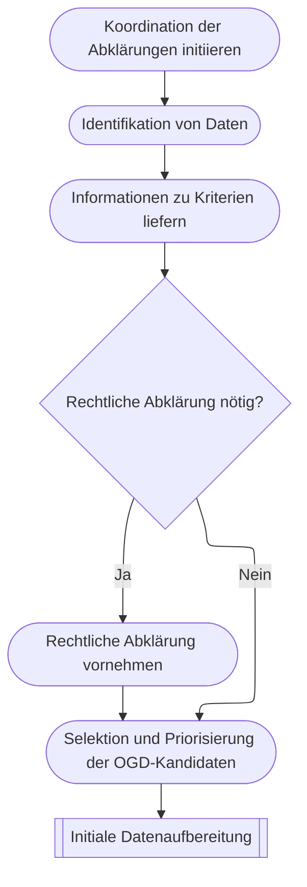

# Bereitstellung

## Koordination der Abklärungen initiieren

Die OGD-Ansprechpersonen identifizieren und nominieren die für die Abklärungen relevanten Personen (Fachpersonen, Stakeholder) beim Data Owner, informieren über das Vorhaben und vereinbaren frühzeitig Meilensteine.
Sie stellen eine Vorlage für die Datenübersicht zur Verfügung.
Diese beinhaltet Kriterien, welche für die Identifikation und Bewertung von OGD-Kandidaten relevant sind. 

:::info[Support durch OGD Kompezenzzentrum]
* Vorlage für die Datenübersicht mit Beurteilungskriterien
* Beratung zur Initiierungsphase
:::

## Identifikation von Daten

Die von der OGD-Ansprechperson involvierten Personen des Data Owners tragen vorhandene und geplante Datenbestände (Datensätze, Datensammlungen oder Datenbanken) des Data Owners in die zur Verfügung gestellte Vorlage ein. 
Datenbestände, die bereits als offene Verwaltungsdaten publiziert wurden, sollen hier ebenfalls eingetragen werden. 

:::info[Support durch OGD Kompezenzzentrum]
* Liste mit bereits publizierten offenen Verwaltungsdaten
:::

## Informationen zu Kriterien liefern

Nach der Identifikation der Datenbestände des Data Owners erfolgt deren Bewertung durch die Fachpersonen des Data Owners bezüglich Schutzbedürfnissen und Priorisierungskriterien.
Dabei werden folgende Fragen beantwortet: 

* **Schützbedürfnisse**: Besteht einer oder mehrere Schützbedürfnisse für die Daten (siehe auch Kapitel [«Nicht zu veröffentlichende Daten»](/ogd-handbuch/grundsaetze#nicht-veroeffentlichende-daten))
* **Priorisierungskriterien**
    * Wie hoch ist der Aufwand für die Abklärungen der Verwendbarkeit des Datenbestands für OGD? Ist mit weitergehenden, allenfalls komplexen  Abklärungen unter Einbezug weiterer Fachpersonen zu rechnen oder liegt eine relativ klare Ausgangslage vor?
    * Wie hoch ist der Aufwand für die Veröffentlichung des Datenbestands? 
    * Ist er aus einem System oder einer Datenbank extrahierbar? Um welchen Datentyp handelt es sich (Sachdaten, Geodaten, Echtzeitdaten, andere)? Existiert eine Programmierschnittstelle? 
    * Ist dokumentiertes Fachwissen zur Verwendung der Daten (Metadaten) vorhanden? 
    * Ist die Datenhoheit eindeutig? Besitzt der Data Owner das alleinige Nutzungsrecht? 
    * Werden die Datenbestände bereits – allenfalls in ähnlicher Form – andernorts veröffentlicht? Oder werden sie in ähnlicher Qualität bereits auf kantonaler oder nationaler Ebene publiziert?
    * Wie gilt es bezüglich Datenqualität zu beachten? 
    * Ist eine hohe Nachfrage vorhanden bzw. zu erwarten? Wie sind das öffentliche Interesse und die gesellschaftliche Relevanz einzustufen?

Die OGD-Ansprechperson trägt die Bewertungen in der Datenübersicht zusammen und ergänzt diese bei Bedarf. 

## Rechtliche Abklärung vornehmen

Sollte es Unsicherheiten geben bezüglich der rechtlichen Einschätzung eines Datenbestandes, so ist eine rechtliche Abklärung durch Fachjuristinnen bzw. Fachjuristen (Rechtsdienst) sinnvoll. 

Mögliche Fragestellungen: 
* Haben wir sämtliche Rechte an den Daten? 
* Welche rechtlichen Einschränkungen müssen beachtet werden? 
* Unterliegen die Daten Geheimhaltungspflichten oder sonstigen rechtlichen Beschränkungen? 
* Sind Einschränkungen bei Nutzungsbedingungen vorhanden? Ist beispielsweise eine Quellenangabe zwingend notwendig?
* Handelt es sich um Personendaten (Daten mit Personenbezug) bzw. lassen sich Rückschlüsse auf Personen oder Unternehmen daraus ableiten? 
* Müssen generell oder bei gewissen Ausprägungen technische Massnahmen (z.B. Anonymisierung) ergriffen werden, um den Datenschutz zu gewährleisten? 
* Wie stark müssen Daten aggregiert werden, um den Datenschutz zu gewährleisten?

Für Fragen rund um den Datenschutz sollte auch das [**Datenschutz-Hilfsmittel**](/datenschutz-hilfsmittel) konsultiert werden.

## Selektion und Priorisierung der OGD-Kandidaten

Basierend auf den gesammelten und konsolidierten Einschätzungen erarbeitet die OGD-Ansprechperson eine Selektion und eine Priorisierung: 
* **Selektion**: Unterteilung der Datensätze in OGD-Kandidaten (als offene Verwaltungsdaten zu veröffentlichen) und Nicht-OGD-Kandidaten (nicht als offene Verwaltungsdaten zu veröffentlichen), gemäss den Ergebnissen zu den Abklärungen zu Schutzbedürfnissen. 
* **Priorisierung**: Erstellen einer Abfolge – basierend auf den Einschätzungen zu den Priorisierungskriterien – in der OGD-Kandidaten als offene Verwaltungsdaten publiziert werden sollen. Daten, die mit wenig Aufwand veröffentlicht werden können und vergleichsweise hohe Relevanz für Daten-Nutzende haben, sollen prioritär veröffentlicht werden. 