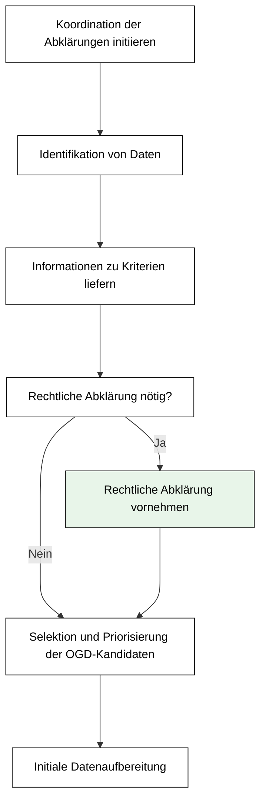
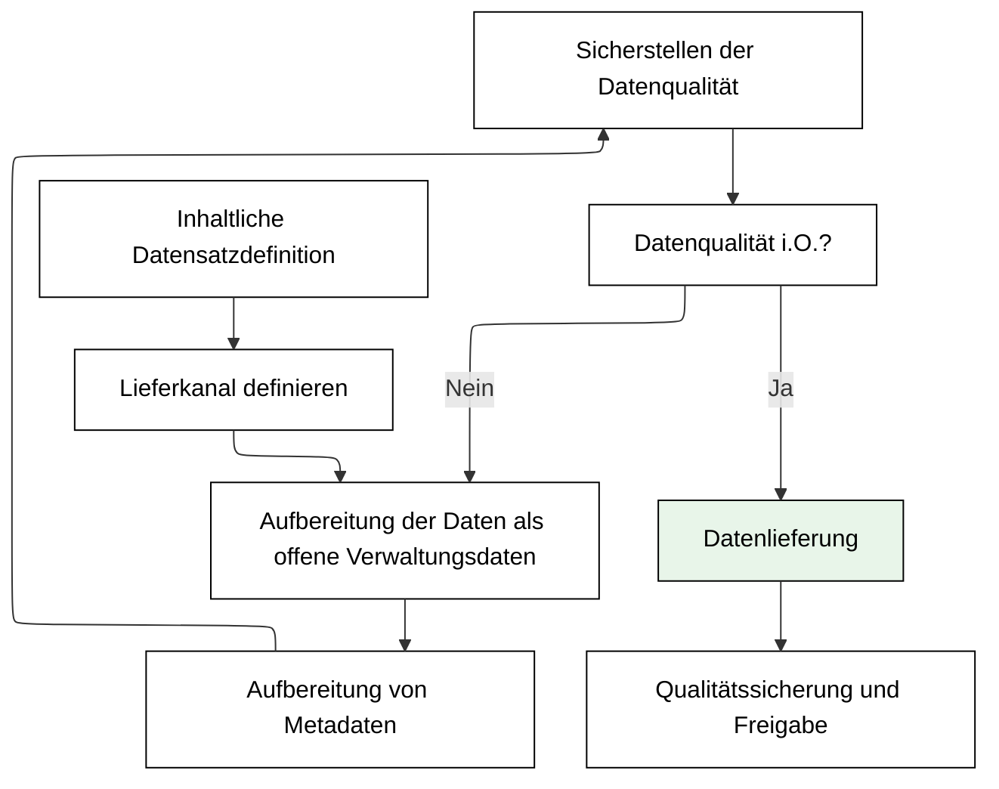
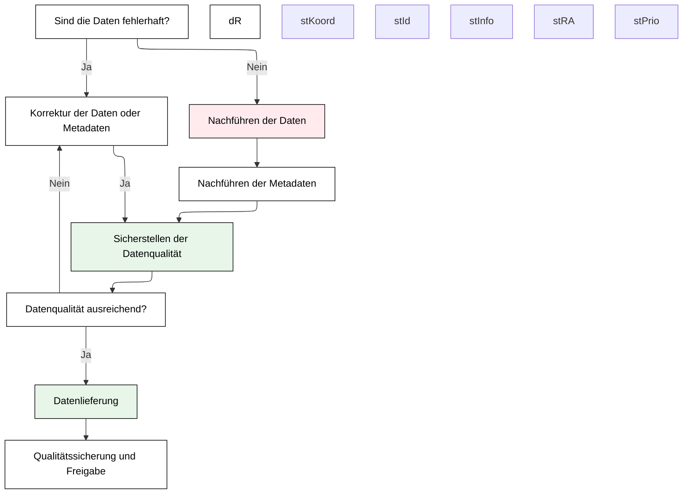
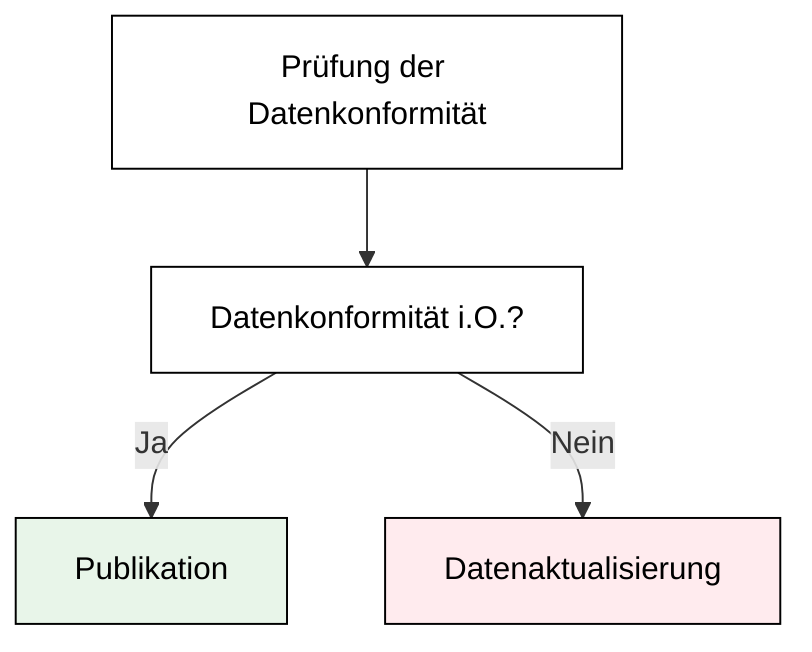

import SupportList from "../common/_support_list.md"

# Bereitstellung

## Auswahl OGD-Kandidaten

Die Prüfung der Verwendbarkeit von Datenbeständen für OGD liegt in der Verantwortung des Data Owners. 
Dieser Teilprozess beschreibt das koordinierte Vorgehen eines Data Owners, um die Datenbestände in der Datenhoheit seiner Organisationseinheit zu identifizieren, sie auf ihre Verwendbarkeit für OGD zu prüfen und sie nachvollziehbar anhand vordefinierter Kriterien zu bewerten.
Die so erstellte Datenübersicht ist die Grundlage für die Auswahl der OGD-Kandidaten und für die Priorisierung und Planung von deren Veröffentlichung.  

### Koordination der Abklärungen initiieren

Die OGD-Ansprechpersonen identifizieren und nominieren die für die Abklärungen relevanten Personen (Fachpersonen, Stakeholder) beim Data Owner, informieren über das Vorhaben und vereinbaren frühzeitig Meilensteine.
Sie stellen eine Vorlage für die Datenübersicht zur Verfügung.
Diese beinhaltet Kriterien, welche für die Identifikation und Bewertung von OGD-Kandidaten relevant sind. 

:::info[Support durch OGD Kompezenzzentrum]
* Vorlage für die Datenübersicht mit Beurteilungskriterien
* Beratung zur Initiierungsphase
:::

### Identifikation von Daten

Die von der OGD-Ansprechperson involvierten Personen des Data Owners tragen vorhandene und geplante Datenbestände (Datensätze, Datensammlungen oder Datenbanken) des Data Owners in die zur Verfügung gestellte Vorlage ein. 
Datenbestände, die bereits als offene Verwaltungsdaten publiziert wurden, sollen hier ebenfalls eingetragen werden. 

<SupportList />

### Informationen zu Kriterien liefern

Nach der Identifikation der Datenbestände des Data Owners erfolgt deren Bewertung durch die Fachpersonen des Data Owners bezüglich Schutzbedürfnissen und Priorisierungskriterien.
Dabei werden folgende Fragen beantwortet: 

* **Schützbedürfnisse**: Besteht einer oder mehrere Schützbedürfnisse für die Daten (siehe auch Kapitel [«Nicht zu veröffentlichende Daten»](/ogd-handbuch/grundsaetze#nicht-veroeffentlichende-daten))
* **Priorisierungskriterien**
    * Wie hoch ist der Aufwand für die Abklärungen der Verwendbarkeit des Datenbestands für OGD? Ist mit weitergehenden, allenfalls komplexen Abklärungen unter Einbezug weiterer Fachpersonen zu rechnen oder liegt eine relativ klare Ausgangslage vor?
    * Wie hoch ist der Aufwand für die Veröffentlichung des Datenbestands? 
    * Ist er aus einem System oder einer Datenbank extrahierbar? Um welchen Datentyp handelt es sich (Sachdaten, Geodaten, Echtzeitdaten, andere)? Existiert eine Programmierschnittstelle? 
    * Ist dokumentiertes Fachwissen zur Verwendung der Daten (Metadaten) vorhanden? 
    * Ist die Datenhoheit eindeutig? Besitzt der Data Owner das alleinige Nutzungsrecht? 
    * Werden die Datenbestände bereits – allenfalls in ähnlicher Form – andernorts veröffentlicht? Oder werden sie in ähnlicher Qualität bereits auf kantonaler oder nationaler Ebene publiziert?
    * Wie gilt es bezüglich Datenqualität zu beachten? 
    * Ist eine hohe Nachfrage vorhanden bzw. zu erwarten? Wie sind das öffentliche Interesse und die gesellschaftliche Relevanz einzustufen?

Die OGD-Ansprechperson trägt die Bewertungen in der Datenübersicht zusammen und ergänzt diese bei Bedarf. 

### Rechtliche Abklärung vornehmen

Sollte es Unsicherheiten geben bezüglich der rechtlichen Einschätzung eines Datenbestandes, so ist eine rechtliche Abklärung durch Fachjuristinnen bzw. Fachjuristen (Rechtsdienst) sinnvoll. 

Mögliche Fragestellungen: 
* Haben wir sämtliche Rechte an den Daten? 
* Welche rechtlichen Einschränkungen müssen beachtet werden? 
* Unterliegen die Daten Geheimhaltungspflichten oder sonstigen rechtlichen Beschränkungen? 
* Sind Einschränkungen bei Nutzungsbedingungen vorhanden? Ist beispielsweise eine Quellenangabe zwingend notwendig?
* Handelt es sich um Personendaten (Daten mit Personenbezug) bzw. lassen sich Rückschlüsse auf Personen oder Unternehmen daraus ableiten? 
* Müssen generell oder bei gewissen Ausprägungen technische Massnahmen (z.B. Anonymisierung) ergriffen werden, um den Datenschutz zu gewährleisten? 
* Wie stark müssen Daten aggregiert werden, um den Datenschutz zu gewährleisten?

Für Fragen rund um den Datenschutz sollte auch das [**Datenschutz-Hilfsmittel**](/datenschutz-hilfsmittel) konsultiert werden.

### Selektion und Priorisierung der OGD-Kandidaten

Basierend auf den gesammelten und konsolidierten Einschätzungen erarbeitet die OGD-Ansprechperson eine Selektion und eine Priorisierung: 
* **Selektion**: Unterteilung der Datensätze in OGD-Kandidaten (als offene Verwaltungsdaten zu veröffentlichen) und Nicht-OGD-Kandidaten (nicht als offene Verwaltungsdaten zu veröffentlichen), gemäss den Ergebnissen zu den Abklärungen zu Schutzbedürfnissen. 
* **Priorisierung**: Erstellen einer Abfolge – basierend auf den Einschätzungen zu den Priorisierungskriterien – in der OGD-Kandidaten als offene Verwaltungsdaten publiziert werden sollen. Daten, die mit wenig Aufwand veröffentlicht werden können und vergleichsweise hohe Relevanz für Daten-Nutzende haben, sollen prioritär veröffentlicht werden. 

## Initiale Datenaufbereitung

Dieser Teilprozess beschreibt das Vorgehen bei einer erstmaligen Veröffentlichung von offenen Verwaltungsdaten.  
Eine Fachperson des Data Owners bestimmt – bei Bedarf mit Unterstützung des OGD-Kompetenzzentrums – den genauen Umfang, Inhalt und die Struktur des neu zu veröffentlichenden Datensatzes.
Dabei ist die Einhaltung allfälliger zuvor definierter Datenschutzmassnahmen zu beachten.
Zu den aufbereiteten Daten werden vollständige Metadaten erfasst.
Bevor die Daten und die Metadaten dem OGD Kompetenzzentrum über einen vordefinierten Lieferkanal zur Verfügung gestellt werden, ist deren Qualität von mindestens einer weiteren Person des Data Owners zu prüfen (Vier-Augen-Prinzip). 

### Inhaltliche Datensatzdefinition

Konkrete inhaltliche Bestimmung der Inhalte, des Umfangs und der Struktur des zu veröffentlichen Datensatzes, meist in Absprache mit dem OGD Kompetenzzentrum. 
Mögliche Fragestellungen sind:
* Welche Datenausprägungen (Attribute), Klassifizierungen, Zeiträume oder räumliche Ausprägungen sollen verwendet werden?

Im Grundsatz sollen offene Verwaltungsdaten so detailliert und so umfangreich wie möglich aber dennoch den Datenschutzvorschriften entsprechend veröffentlicht werden. 
Mögliche Auflagen und Einschränkungen aus den vorhergehenden Abklärungen sind zu berücksichtigen. 

### Lieferkanal definieren

Die Definition des Lieferkanals und des Ablageorts der Daten und der Metadaten erfolgt zwischen dem OGD Kompetenzzentrum und dem Data Owner unter der Leitung des OGD Kompetenzzentrum.
Lieferkanal und Ablageort können je nach Datentyp (siehe Beschreibung nachfolgende Aktivität) unterschiedlich sein.
Bei der Definition des Lieferkanals und Ablageorts soll bereits an die künftigen Datenaktualisierungen gedacht werden. 

### Aufbereitung der Daten als offene Verwaltungsdaten

Der Datenaufbereitungsprozess soll von Anfang an möglichst so gestaltet werden, 
dass er für künftige Datenaktualisierungen automatisiert ablaufen kann. 

Gemäss OGD-Veröffentlichungsprinzipien [^1] sollten die Daten bereits in maschinenlesbarer Struktur und wenn möglich in offenen Datenformaten geliefert werden. 
Je nach Datentyp sind die Aufbereitungsprozesse anders und unterschiedlich aufwändig: 

* **Geodaten**: Geodaten werden nach standardisiertem Prozess via die Geodateninfrastruktur zur Verfügung gestellt
* Programmierschnittstellen: Bei Vorhandensein einer  Programmierschnittstelle müssen keine Daten aufbereitet, sondern lediglich der Zugriff auf die Schnittstelle gewährleistet werden. 
* Sachdaten: Sachdaten entsprechen in der Regel maschinenlesbaren Listen. Durch ein professionelles Datenmanagement bei Data Ownern kann der Aufwand bei der Datenaufbereitung stark reduziert werden. Sofern die Sachdaten aus einem bestehenden System (Datenbank oder Data Warehouse, DWH) exportiert werden können, lässt sich der Datenaufbereitungsprozess einfach automatisieren.

:::info[Support durch OGD Kompezenzzentrum]
* Unterstützung beim Datenaufbereitungsprozess, insbesondere in der Automatisierung. 
:::

### Aufbereitung von Metadaten

Die Datenbeschreibungen offener Verwaltungsdaten sollen so umfangreich und präzise sein, dass Daten-Nutzende Daten auf dem OGD-Katalog problemlos finden, deren Inhalte ohne Rückfragen oder Recherchen verstehen und in der Lage sind, diese korrekt zu interpretieren. 
Die Metadaten sind strukturell gemäss dem standardisierten Metadatenmodell und inhaltlich gemäss den Anforderungen des OGD Kompetenzzentrums zu erfassen.

:::info[Support durch OGD Kompezenzzentrum]
* Dokumentation der Metadaten-Attribute
* Unterstützung bei der Klassifikation von Datensätzen
:::

### Sicherstellen der Datenqualität

Die Qualitätssicherung für die inhaltliche Richtigkeit der Daten ist in der Verantwortung des Data Owners.
Er prüft, die Vollständigkeit und Plausibilität der Daten und die Qualität der Metadaten.

Zu prüfende Sachverhalte umfassen: 
* Fehlen Werte? Hat es z.B. in einer Zeitreihe umfangreiche und unerklärliche Lücken? 
* Scheinen die Werte bzw. Wertebereiche plausibel? Oder gibt es unplausible Ausreisser? 
* Stimmen aus den Daten abgeleitete Werte überein mit anderswo bereits publizierten und qualitätsgesicherten Werten, z.B. aus Geschäftsberichten? 
* Sind die Metadaten so beschrieben, dass Daten-Nutzende selbstständig damit arbeiten können? 

### Datenlieferung

Der Data Owner liefert die qualitätsgesicherten Daten und Metadaten gemäss den zuvor getroffenen Vereinbarungen an das OGD Kompezenzzentrum zwecks Veröffentlichung. 

## Datenaktualisierung

Bei der Datenaktualisierung werden bereits publizierte offene Verwaltungsdaten gemäss vereinbarter Aktualisierungsfrequenz aktualisiert (z.B. zur Fortführung einer Zeitreihe) oder vorgängig dazu noch Daten und Metadaten korrigiert.
Eine Korrektur kann von einer Fehlermeldung von Daten-Nutzenden ausgehen oder durch interne Qualitätssicherungen des Data Owners oder des OGD-Kompetenzzentrums initiiert werden. 

### Korrektur der Daten oder Metadaten

Bei einer berechtigterweise erfolgten Fehlermeldung sind fehlerhafte offene Verwaltungsdaten oder Metadaten umgehend zu korrigieren.
Sollte eine Korrektur nicht möglich sein (z.B. fehlende Werte), so muss dies in den Metadaten im Feld «Datenqualität» festgehalten werden. 

### Nachführen der Daten

Der Data Owner aktualisiert oder ersetzt offene Verwaltungsdaten.
Dieser Prozess sollte möglichst automatisiert ablaufen (vgl. oben [«Aufbereitung von Verwaltungsdaten als offene Verwaltungsdaten»](#aufbereitung-der-daten-als-offene-verwaltungsdaten)). 

### Nachführen der Metadaten

Wenn bestehende offene Verwaltungsdaten aktualisiert werden, muss der Data Owner auch sicherstellen, dass die dazu gehörenden Metadaten weiterhin stimmen. 
Der Data Owner passt in jedem Fall das Aktualisierungsdatum an. 

### Sicherstellen der Datenqualität

Die Qualitätssicherung für die inhaltliche Richtigkeit der Daten ist in der Verantwortung des Data Owners.
Er prüft, die Vollständigkeit und Plausibilität der Daten und die Qualität der Metadaten.

Zu prüfende Sachverhalte umfassen: 
* Fehlen Werte? Hat es z.B. in einer Zeitreihe umfangreiche und unerklärliche Lücken? 
* Scheinen die Werte bzw. Wertebereiche plausibel? Oder gibt es unplausible Ausreisser? 
* Stimmen aus den Daten abgeleitete Werte überein mit anderswo bereits publizierten und qualitätsgesicherten Werten, z.B. aus Geschäftsberichten? 
* Sind die Metadaten so beschrieben, dass Daten-Nutzende selbstständig damit arbeiten können? 

### Datenlieferung

Der Data Owner liefert die qualitätsgesicherten Daten und Metadaten gemäss den zuvor getroffenen Vereinbarungen an das OGD Kompezenzzentrum zwecks Veröffentlichung. 

## Qualitätssicherung und Freigabe

Das OGD-Kompetenzzentrum prüft die Daten und Metadaten auf relevante Qualitätsmerkmale und stellt so sicher, dass die Datenkonformität eingehalten wird. 
Wenn alle Qualitätskriterien erfüllt sind, gibt das Kompetenzzentrum den Datensatz für die Publikation frei, ansonsten wird er dem Data Owner zur Korrektur übergeben.

### Prüfen der Datenkonformität

Die vom Data Owner gelieferten Daten und Metadaten werden vom OGD-Kompetenzzentrum auf Konformität geprüft. Dies umfasst in der Regel:

* Durchführung einer einfachen Plausibilitätsprüfung, um Auffälligkeiten in den Daten zu finden. 
* Quantifizierung von allfälligen fehlenden Daten 
* Prüfung der Maschinenlesbarkeit der Datensätze 
* Prüfung auf Lesbarkeit und Vollständigkeit der Attribute in den Datensätzen und Metadaten 
* Kontrolle der Vollständigkeit und Verständlichkeit der Metadaten 
* Prüfung der Umsetzung allenfalls vereinbarter Datenschutzmassnahmen 
* Testen der Datenverwendbarkeit 

Sofern während der Datenkonformitätsprüfungen die Qualitätsanforderungen erfüllt und keine Mängel entdeckt wurden, kann zum Publikationsprozess geschritten werden.
Ansonsten informiert das OGD-Kompetenzzentrum den Data Owner über die gefundenen Mängel und wie diese im [Teilprozess «Datenaktualisierung»](#datenaktualisierung) behoben werden sollen.  

<!-- @NOSPELL@ -->

[^1]: Veröffentlichungsprinzipien: [Ten Principles for opening up Government Information (Sunlight Foundation)](https://sunlightfoundation.com/policy/documents/ten-open-data-principles/)

<!-- @ENDNOSPELL@ -->
