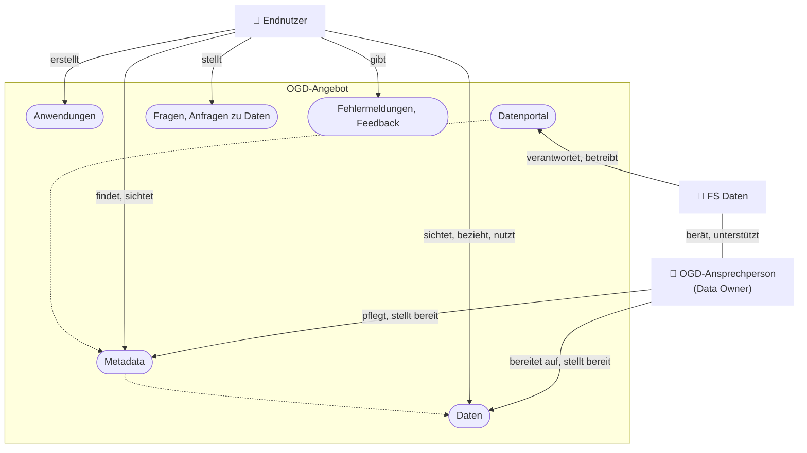

# Übersicht der OGD-Prozesse

Bei der Veröffentlichung von Daten als offene Verwaltungsdaten können die in 
der Abbildung skizzierten drei Hauptakteure (Daten-Nutzende, Data Owner und das 
Fachstelle OGD) und die folgenden sechs Hauptprozesse unterschieden 
werden:

0. Produktion
0. Bereitstellung
0. Publikation
0. Anfragen
0. Support
0. Nutzung

Im Folgenden werden detaillierte Teilprozesse beschrieben, die zur Veröffentlichung offener Verwaltungsdaten nötig sind.

