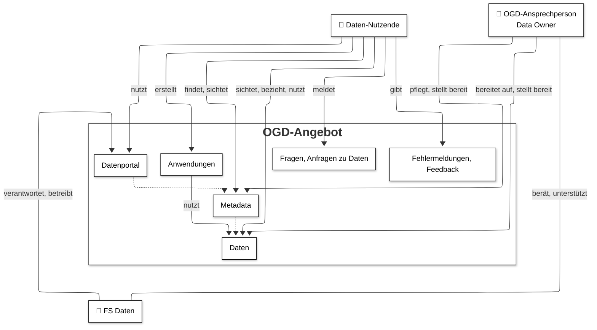

# Übersicht der OGD-Prozesse

Bei der Veröffentlichung von Daten als offene Verwaltungsdaten können die in 
der Abbildung skizzierten drei Hauptakteure (Daten-Nutzende, Data Owner und das 
FS Daten) und die folgenden fünf Hauptprozesse unterschieden 
werden:

1. [Produktion](/ogd-handbuch/prozesse/produktion)
2. [Bereitstellung](/ogd-handbuch/prozesse/bereitstellung)
1. [Publikation](/ogd-handbuch/prozesse/publikation)
1. [Anfragen](/ogd-handbuch/prozesse/anfragen)
1. [Support](/ogd-handbuch/prozesse/support)

Im Folgenden werden detaillierte Teilprozesse beschrieben, die zur Veröffentlichung offener Verwaltungsdaten nötig sind.
Auf den vorgelagerten Hauptprozess «Produktion» wird nicht weiter eingegangen, da dieser sehr spezifisch für jeden Datensatz ist.
Bei OGD handelt es sich immer um eine Sekundärnutzung von Daten, die bereits angefallen sind.
Eine separate Erhebung von Daten für OGD ist nicht vorgesehen.

