# Übersicht der OGD-Prozesse

```mermaid
---
config:
  layout: dagre
---
flowchart TB
 subgraph S["OGD-Angebot"]
    direction TB
        ucApp(["Anwendungen"])
        ucDP(["Datenportal"])
        ucMD(["Metadata"])
        ucD(["Daten"])
        ucQA(["Fragen, Anfragen zu Daten"])
        ucFB(["Fehlermeldungen, Feedback"])
  end
    ucDP -.-> ucMD
    ucMD -.-> ucD
    rN["👤 Daten-Nutzende"] -- nutzt --> ucDP
    ucDP ~~~ rF["👤 FS Daten"] & rF
    rN -- erstellt --> ucApp
    rN -- findet, sichtet --> ucMD
    rN -- sichtet, bezieht, nutzt --> ucD
    ucApp -- nutzt --> ucD
    rN -- meldet --> ucQA
    rN -- gibt --> ucFB
    rF -- verantwortet, betreibt --> ucDP
    rA["👤 OGD-Ansprechperson
  (Data Owner)"] -- pflegt, stellt bereit --> ucMD
    rA -- bereitet auf, stellt bereit --> ucD
    rF -- berät, unterstützt --- rA
     rN:::role
     rF:::role
     rA:::role
    classDef role stroke-width:0px

```

Bei der Veröffentlichung von Daten als offene Verwaltungsdaten können die in 
der Abbildung skizzierten drei Hauptakteure (Daten-Nutzende, Data Owner und das 
FS Daten) und die folgenden sechs Hauptprozesse unterschieden 
werden:

1. Produktion 
2. [Bereitstellung](/ogd-handbuch/prozesse/bereitstellung)
1. [Publikation](/ogd-handbuch/prozesse/publikation)
1. [Anfragen](/ogd-handbuch/prozesse/anfragen)
1. [Support](/ogd-handbuch/prozesse/support)
1. [Nutzung](/ogd-handbuch/prozesse/nutzung)

Im Folgenden werden detaillierte Teilprozesse beschrieben, die zur Veröffentlichung offener Verwaltungsdaten nötig sind.
Auf den vorgelagerten Hauptprozess «Produktion» wird nicht weiter eingegangen, da dieser sehr spezifisch für jeden Datensatz ist.
Bei OGD handelt es sich immer um eine Sekundärnutzung von Daten, die bereits angefallen sind.
Eine Erhebung von Daten für OGD ist nicht vorgesehen.

