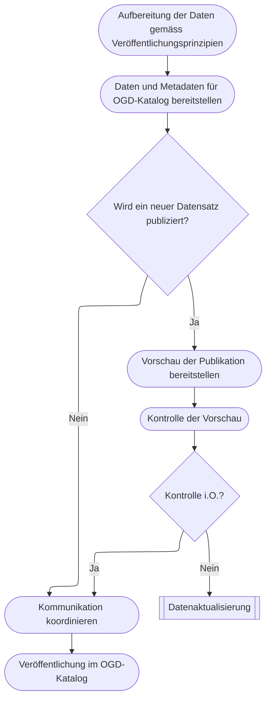

# Publikation

Der letzte Teilprozess vor der Verfügbarkeit der Datensätze und Metadaten auf dem OGD-Katalog ist die Publikation.  
Darin enthalten ist die Datenaufbereitung gemäss der OGD-Veröffentlichungsprinzipien sowie die Aktualisierung der Inhalte auf dem OGD-Katalog.
Bei neu zu publizierenden Daten wird eine Vorschau zur Verfügung gestellt, damit Data Owner die Inhalte der neu zu publizierenden Webseite kontrollieren können. 

## Aufbereitung der Daten gemäss OGD-Veröffentlichungsprinzipien

Das OGD-Kompetenzzentrum publiziert alle offenen Verwaltungsdaten gemäss den OGD-Veröffentlichungsprinzipien[^1].

In diesem Aufbereitungsschritt berücksichtigt es insbesondere folgende Punkte: 

* Vollständigkeit und Verständlichkeit der Daten 
* Maschinenlesbarkeit der Daten 
* Offene Standards und Schnittstellen 
* Offenlegung der Primärquellen 

## Daten und Metadaten für OGD-Katalog bereitstellen

Das OGD-Kompetenzzentrum stellt die Daten und Metadaten so bereit, dass diese vom OGD-Katalog automatisiert verarbeitet werden können. 

## Vorschau der Publikation bereitstellen

Wenn ein neuer Datensatz publiziert wird, erstellt das OGD-Kompetenzzentrum vor der Veröffentlichung eine Vorschau der zu veröffentlichenden Inhalte zuhanden des Data Owners (z.B. auf der Testumgebung des OGD-Katalogs).

## Kontrolle der Vorschau

Falls eine Vorschau für einen Datensatz bereitgestellt wird, prüft der Data Owner diese.
Im Fokus stehen dabei die Metadaten, welche im OGD-Katalog dargestellt werden.  

## Kommunikation koordinieren

Das OGD-Kompetenzzentrum koordiniert die Kommunikation über neue oder aktualisierte Datensätze mit dem Data Owner.

## Veröffentlichung auf dem OGD-Katalog

Wenn der ganze Teilprozess durchlaufen ist, veröffentlicht das OGD-Kompetenzzentrum den Datensatz im OGD-Katalog [7].
Somit steht der Datensatz der Öffentlichkeit zur freien Verfügung.

<!-- @NOSPELL@ -->

[^1]: Veröffentlichungsprinzipien: [Ten Principles for opening up Government Information (Sunlight Foundation)](https://sunlightfoundation.com/policy/documents/ten-open-data-principles/)

<!-- @ENDNOSPELL@ -->